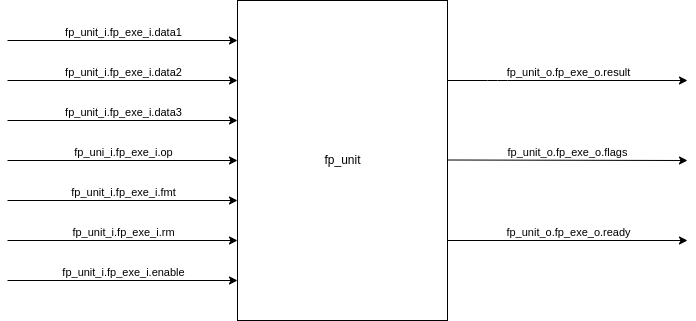

# FPU Single and Double Precision

This floating point unit is conform to IEEE 754-2008 standards. Supported operations are **compare**, **min-max**, **conversions**, **addition**, **subtruction**, **multiplication**, **fused multiply add**, **square root** and **division** in single and double precisions. Except **square root** and **division** all operations are pipelined.

This unit uses canonical **nan** (not a number) form, if it generates any **nan** as output. E.g. 0x7FC00000 for single precision and 0x7FF8000000000000 for double precision. Therefore extra conditions are added in order compare outputs with testfloat data correctly by **nan** generation.

**Square root** and **division** calculations are using same subunit but different path (algorithm). This subunit has a generic variable **_performance_**. For functional iterations which are fast please use **1** and fixed point iterations which are slow use **0**. This unit has also own multiplier.

## DESIGN

This floating point unit uses only one path for both single and double precisions by scaling up both of them to the pseudo extended precision. The main benefit of this implementation is that the design needs few resources because we do not implement extension in pipeline to handle subnormal numbers. It means that all floating numbers are normalized thanks to pseudo extended precision. The main disadvantage of this unit is that it is not suitable for single instruction multiple data (simd) architecture.

|        | sign | exponent | mantissa |
|:------:|:----:|:--------:|:--------:|
| single | 1    | 8        | 23       |
| double | 1    | 11       | 52       |
| pseudo | 1    | 12       | 52       |

## LATENCY

### Single and Double Precision

| comp | max | conv | add | sub | mul | fma |
|:----:|:---:|:----:|:---:|:---:|:---:|:---:|
| 1    | 1   | 1    | 3   | 3   | 3   | 3   |

### Single Precision

|performance| division | square root |
|:---------:|:--------:|:-----------:|
| 0         | 29       | 28          |
| 1         | 14       | 17          |

### Double Precision

|performance| division | square root |
|:---------:|:--------:|:-----------:|
| 0         | 58       | 57          |
| 1         | 14       | 17          |

## UNIT



### SIGNALS

| op | type |
|:---|:-----|
| fmadd | $(data1*data2)+data3$ |
| fmsub | $(data1*data2)-data3$ |
| fnmsub | $-(data1*data2)+data3$ |
| fnmadd | $-(data1*data2)-data3$ |
| fadd | $data1+data2$ |
| fsub | $data1-data2$ |
| fmul | $data1*data2$ |
| fdiv | $data1/data2$ |
| fsqrt | $\sqrt{data1}$ |

| op | rm | type |
|:---|:---|:-----|
| fsgnj | "000" | J |
| fsgnj | "001" | JN |
| fsgnj | "010" | JX |

| op | rm | type |
|:---|:---|:-----|
| fcmp | "000" | EQ |
| fcmp | "001" | LT |
| fcmp | "010" | LE |

| op | rm | type |
|:---|:---|:-----|
| fmax | "000" | MIN |
| fmax | "001" | MAX |

| op | op.fcvt_op | fmt | type |
|:---|:-----------|:----|:-----|
| fcvt_f2i | "00" | "00" | CONVERSION FROM FLOAT TO INT32  |
| fcvt_f2i | "01" | "00" | CONVERSION FROM FLOAT TO UINT32  |
| fcvt_f2i | "10" | "00" | CONVERSION FROM FLOAT TO INT64   |
| fcvt_f2i | "11" | "00" | CONVERSION FROM FLOAT TO UINT64  |
| fcvt_f2i | "00" | "01" | CONVERSION FROM DOUBLE TO INT32  |
| fcvt_f2i | "01" | "01" | CONVERSION FROM DOUBLE TO UINT32 |
| fcvt_f2i | "10" | "01" | CONVERSION FROM DOUBLE TO INT64  |
| fcvt_f2i | "11" | "01" | CONVERSION FROM DOUBLE TO UINT64 |

| op | op.fcvt_op | fmt | type |
|:---|:-----------|:----|:-----|
| fcvt_i2f | "00" | "00" | CONVERSION FROM INT32 TO FLOAT   |
| fcvt_i2f | "01" | "00" | CONVERSION FROM UINT32 TO FLOAT  |
| fcvt_i2f | "10" | "00" | CONVERSION FROM INT64 TO FLOAT   |
| fcvt_i2f | "11" | "00" | CONVERSION FROM UINT64 TO FLOAT  |
| fcvt_i2f | "00" | "01" | CONVERSION FROM INT32 TO DOUBLE  |
| fcvt_i2f | "01" | "01" | CONVERSION FROM UINT32 TO DOUBLE |
| fcvt_i2f | "10" | "01" | CONVERSION FROM INT64 TO DOUBLE  |
| fcvt_i2f | "11" | "01" | CONVERSION FROM UINT64 TO DOUBLE |

| op | op.fcvt_op | fmt | type |
|:---|:-----------|:----|:-----|
| fcvt_f2f | "01" | "00" | CONVERSION FROM DOUBLE TO FLOAT |
| fcvt_f2f | "00" | "01" | CONVERSION FROM FLOAT TO DOUBLE |

| fmt | type |
|:----|:-----|
| "00" | FLOAT  |
| "01" | DOUBLE |

| rm | type |
|:---|:-----|
| "000" | RNE |
| "001" | RTZ |
| "010" | RDN |
| "011" | RUP |
| "100" | RMM |

| flags | type |
|:------|:-----|
| "00001" | NX |
| "00010" | UF |
| "00100" | OF |
| "01000" | DZ |
| "10000" | NV |

## TOOLS

The installation scripts of necessary tools are located in directory **tools**. These scripts need **root** permission in order to install packages and tools for simulation and testcase generation. Please run these scripts in directory **tools** locally.

## GENERATE

To generate test cases you could use following command:

```console
make generate
```

## SIMULATION

To simulate the design together with generated test cases you could run following command:

```console
make simulate
```

This command requires two options for hardware description languages **VERILOG** and **VHDL**. The possible settings of these options can be found in the makefile.

Some example executions of this command look like as follows:

```console
make simulate VERILOG=1
make simulate VHDL=1
```

## SINGLE PRECISION

[Link for floating point unit with only single precision format.](https://github.com/taneroksuz/fpu-sp.git)
